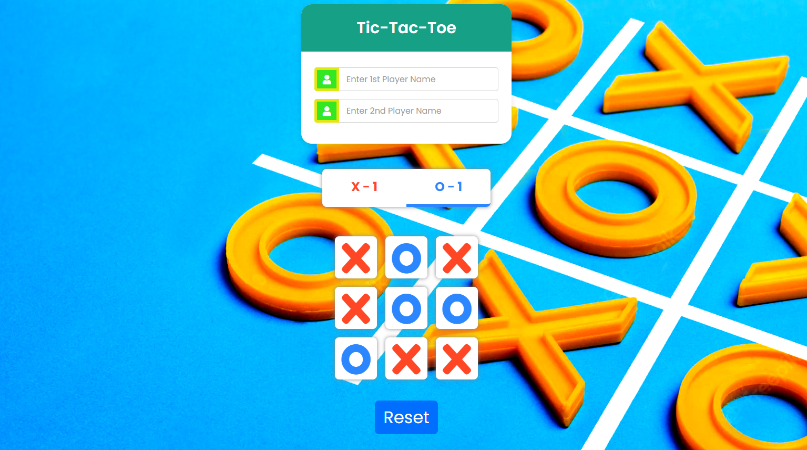

# React : Tic-Tac-Toe

Build a Tic Tac Toe game using React hooks, functional components, props, state, hooks, HTML, and CSS.. 

React is a Declarative, Component-Based JavaScript library for building user interfaces. It is maintained by Facebook and a community of individual developers and companies.

### [Live Site](https://62c93060ee66ed39d8c8c263--jolly-monstera-36c302.netlify.app/)

# Contribution

If you went through the project and saw some inconsistencies or if you have an idea to make the overall project better please feel free to open a PR.

Prior to any pull-request, we advise to [open an issue](https://github.com/Adarsh-Agrahari/tic-tac-toe/issues). This is because, although we are happy to merge your code, we must make sure the changes don't impact our way of doing things, thus resulting on a declined PR, and your time wasted.

# License

Tic-Tac-Toe is available under the [Apache License 2.0](https://github.com/Adarsh-Agrahari/tic-tac-toe/blob/main/LICENSE.md). Use it wisely.